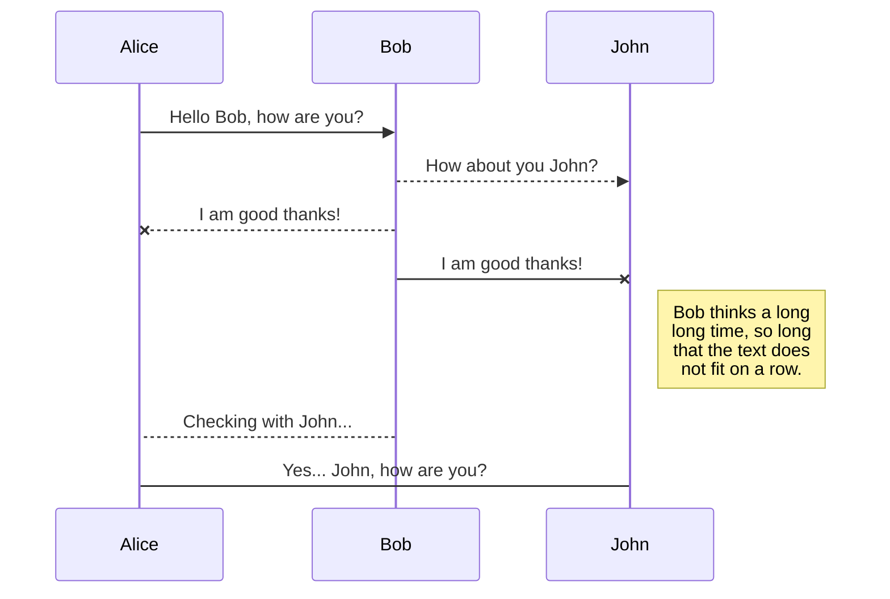

## diagrams

## diagrams{.tabset}

### mermaid



### uml
```plantuml
Bob->Alice : hello
```

## lists

- [ ] some
- [x] thing
- [ ] todo


## Headers
## Tabs {.tabset}

### Example

Headers shown bellow

### code

> \# Header 1  
\## Header 2  
\### Header 3  
\#### Header 4  
\##### Header 5  
\###### Header 6

# Header 1

## Header 2

### Header 3

#### Header 4

##### Header 5

###### Header 6